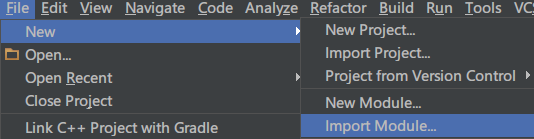
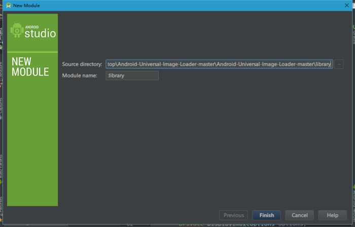
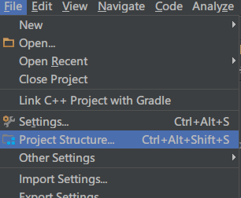
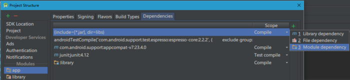
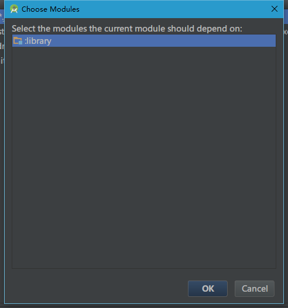

# Android Studio 常用操作
## 1 如何引用第三方Jar包
 - (1) 直接导入jar包
  -
 - (2) 导入源码
  - 下载源码
  - 添加Module
    - 导入Module
      
    - 选中源码库 : 
  - 依赖Module
    - 打开Project Structure
    
    - 选中主工程，也就是app，然后点击右上角的+号，选择Module Dependency。
    
    - 选择Module Dependency 最后选择刚才添加进来的:library
    
 - (3) AndroidStudio中直接通过Gradle的方式添加第三方开源库
  -
## 2 第三方插件使用
  - （1）GSonFormat：快捷键使用方式,在bean代码界面 使用 Alt + s [GSonFormat使用方式详解](http://blog.csdn.net/alpha58/article/details/62881144)
  - （2) Android Code Generator ：一种根据布局文件生成Activity 、Fragment、Menu、Adapter
    - 使用方式为1 在布局文件中右键，选择Generate Android Code ，复制代码 或者 选择source file路径，点击创建文件即可。
    - 详细使用方式  [Android Code Generator使用方式详解](http://blog.csdn.net/alpha58/article/details/62881144)
